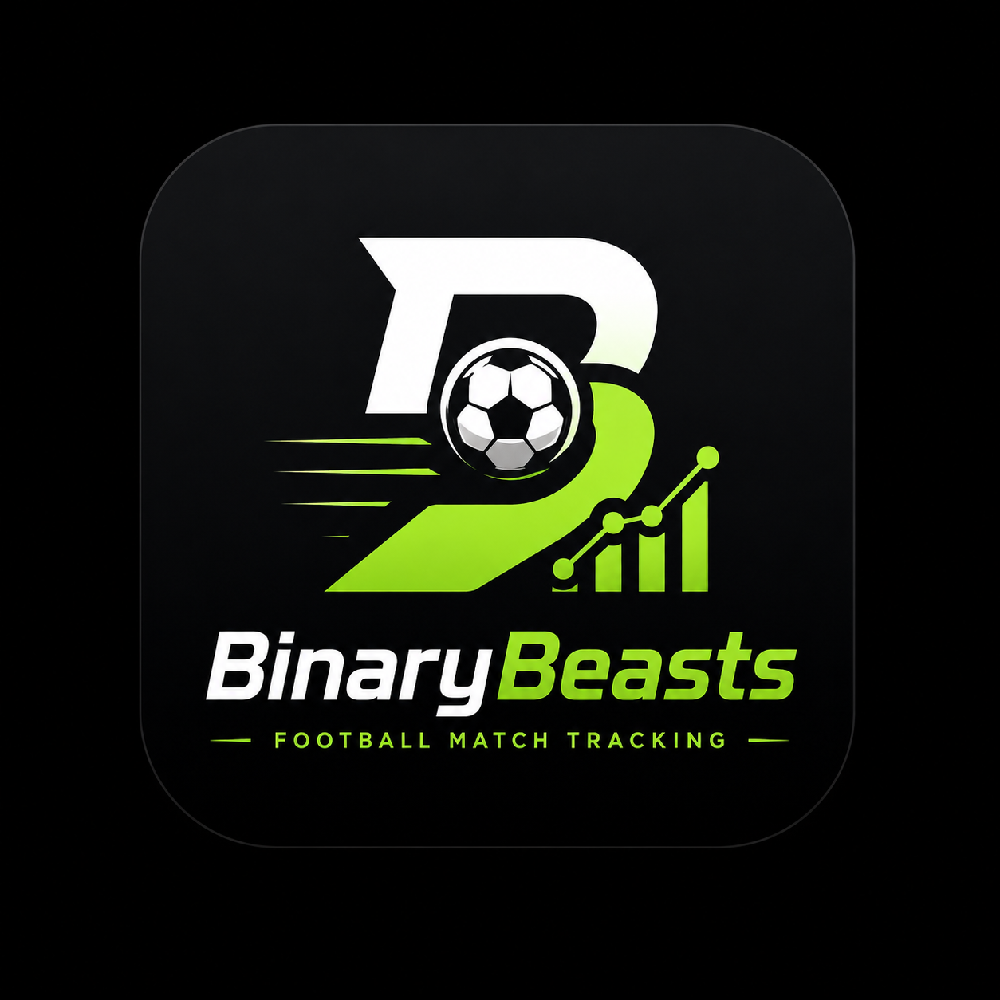

<div align="center">


# ⚽ BinaryBeasts — Pitch & Score




**Desktop football league manager — standings, live scores, fixtures, and season stats**

</div>

---

<div align="center">

# 📋 Table of Contents

[🎯 About the Project](#-about-the-project)

[🏆 League Standings (Presentation)](#-league-standings-presentation)

[🚀 Core Features](#-core-features)

[🛠️ Used Technologies](#️-used-technologies)

[📊 System Overview](#-system-overview)

[👥 Contributors](#-contributors)

[📦 Setup](#-setup)

[▶️ Run the App](#️-run-the-app)

</div>

---

<div align="center">

# 🎯 About the Project

</div>

---

**BinaryBeasts (Pitch & Score)** is a C++ desktop app built with **raylib**. It follows a **three-tier architecture**: `presentation` → `logic` → `data`.

### ✨ What users can do

🏆 Manage the **League Standings** table (add, edit, sort, search teams)

🔴 Preview **Live scores** (simulated from team data)

📅 Browse a **Match schedule** (generated fixtures)

📈 View **Season stats** (recursive totals)

💾 Persist teams in `database.bin` between sessions

### 🧩 Main menu screens (`football_menu.cpp`)

| Menu item | Screen |
| --------- | ------ |
| League table & points | `LeagueStandings` (`presentation.cpp`) |
| Live scores (simulated) | `LiveScores` |
| Match schedule | `MatchSchedule` |
| Season stats | `SeasonStats` |
| About this app | `About` |
| Exit | Quit |

---

<div align="center">

# 🏆 League Standings (Presentation)

</div>

---

The **League Standings** screen is drawn in `presentation.cpp` (`run_app`). Window title: **Pitch & Score** (1200×800). Main panel title: **LEAGUE STANDINGS**.

### Table columns (card list header)

Each team is shown as a **card row** with these columns (same labels as in the UI):

| Column | Source field | UI behaviour |
| ------ | ------------ | -------------- |
| **Team** | `Team.name` | Name + avatar initials + points progress bar vs league leader |
| **Points** | `Team.points` | Display; **+** / **−** buttons adjust points (saved via `persist_teams_logic`) |
| **Goals** | `Team.goalsScored` | Display; editable in the Edit modal |
| **Tier** | derived from `Team.points` | Label from `GetScoreTier()` (see below) |
| **Edit** | — | Pencil button opens modal: name, goals, points |

### Tier labels (`GetScoreTier` in `presentation.cpp`)

| Points | Tier shown |
| ------ | ---------- |
| ≥ 18 | Elite |
| ≥ 10 | Strong |
| ≥ 4 | Rising |
| < 4 | Developing |

### Sidebar (`presentation.cpp`)

| Control | Action |
| ------- | ------ |
| **Main menu** | Return to home menu |
| **Add Team** | Modal: team name → `add_team_logic` |
| **Sort: Points / Goals / Name** | Cycles `sortMode` 0→1→2 → `sort_teams_by_mode_logic` |
| **Delete Last** | `delete_last_team_logic` |
| **Clear All** | `clear_all_teams_logic` |
| **Search name** | ENTER: linear or binary (if sorted by name) + partial match; highlights found row |

### Keyboard shortcuts (footer hints)

| Key | Action |
| --- | ------ |
| **F1** | Cycle sort (points → goals → name) |
| **F2** | Delete last team |
| **F3** | Clear all teams |
| **ENTER** (search box) | Find team; binary search when sorted by name |
| **ESC** | Close modals / back from sub-screens |

### Footer panel (same screen)

| Element | Description |
| ------- | ------------- |
| **Total Goals** | `calculate_total_goals_from_teams_recursive` |
| **Score insights** | Leader name, points, average points, leader tier |
| **List hint** | Up to **5** teams visible; `Showing X–Y of N teams` if more exist |
| **Search result** | `Found: #rank Name` or `No match` under search box |

### Default teams (if `database.bin` is empty)

On first run, `presentation.cpp` seeds: **Real Madrid**, **FC Barcelona**, **Manchester City** (0 points, 0 goals each).

### `Team` record (`data.h`)

| Field | Type | Max / notes |
| ----- | ---- | ----------- |
| `id` | `int` | Auto on add |
| `name` | `char[50]` | 49 chars + null |
| `points` | `int` | Table points |
| `goalsScored` | `int` | Season goals |

---

<div align="center">

# 🚀 Core Features

</div>

---

### 🧭 Presentation layer

`presentation.cpp` — main loop, League Standings UI, modals, search highlight

`football_menu.cpp` — main menu and sub-screens (live, schedule, stats, about)

### 🧠 Logic layer (`logic.cpp`)

**Sort:** Quick Sort (points), `std::sort` (goals, name)

**Search:** linear, binary (name sort), partial name match

**Recursion:** total goals, total points, demo match goals series

**Persistence:** `load_teams_logic` / `persist_teams_logic` → `data` layer

### 💾 Data layer (`data.cpp`)

Binary read/write of `Team` records to `database.bin`

---

<div align="center">

# 🛠️ Used Technologies

</div>

---

<div align="center">

<a href="https://cplusplus.com/"></a>
<a href="https://www.raylib.com/"></a>
<a href="https://visualstudio.microsoft.com/"></a>
<a href="https://www.nuget.org/"></a>
<a href="https://github.com/"></a>

</div>

---

<div align="center">

# 📊 System Overview

</div>

---

| Component | Layer | Responsibility |
| --------- | ----- | -------------- |
| `main.cpp` | — | Entry point, calls `run_app()` |
| `presentation.cpp` | Presentation | GUI, League Standings, user input |
| `football_menu.cpp` | Presentation | Main menu & sub-screens |
| `team_ui.cpp` | Presentation | Reusable team card helpers |
| `logic.cpp` | Logic | Sort, search, recursion, persist wrappers |
| `data.cpp` | Data | `database.bin` load/save |

```txt
Presentation  →  Logic  →  Data
(presentation,     (logic.cpp)   (data.cpp,
 football_menu)                  database.bin)
```

---

<div align="center">

# 👥 Contributors

</div>

---

<table>
  <tr>
    <td align="center" width="250">
      <br><br>
      <b>Мирослав Илиев</b><br>
      <sub>🎯 Scrum Trainer</sub>
    </td>
    <td align="center" width="250">
      <br><br>
      <b>Йордан Райнов</b><br>
      <sub>⚙️ Front-End Developer</sub>
    </td>
  </tr>
  <tr height="50"></tr>
  <tr>
    <td align="center" width="250">
      <br><br>
      <b>Димитър Нягалов</b><br>
      <sub>⚙️ Back-End Developer</sub>
    </td>
    <td align="center" width="250">
      <br><br>
      <b>Иван Трифанов</b><br>
      <sub>🎨 Back-End Developer</sub>
    </td>
  </tr>
</table>

---

<div align="center">

# 📦 Setup

</div>

---

### ⚙️ Requirements

Windows

Visual Studio 2022 (MSVC v143)

NuGet package restore enabled

Git

### 📥 Installation

```bash
git clone https://github.com/<your-username>/BinaryBeasts.git
cd BinaryBeasts
```

Open `BinaryBeasts.sln` in Visual Studio.

Restore NuGet packages (raylib in `packages.config`).

Select `Debug | x64` (or your configuration).

Build the solution.

---

<div align="center">

# ▶️ Run the App

</div>

---

Run with **F5** / **Ctrl+F5** from Visual Studio.

Home menu: **Pitch & Score** → open **League table & points**.

Changes are saved to `database.bin` on edit and on exit.
